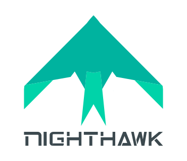

# Nighthawk

- Project site: https://getnighthawk.dev
- Project doc: https://docs.google.com/document/d/1lHfMo4iIx2WXFZIspfHyxTsPR1T63_2IV5NUkgxoo0w/edit#
- Project Slack: http://slack.layer5.io

## What is Nighthawk?

Nighthawk is a versatile HTTP load testing tool built out of a need to drill HTTP services with a constant request rate or with an adaptive request rate. Layer5 offers a custom distribution of Nighthawk with intelligent adaptive load controllers to automatically identify optimal configurations for your service mesh deployment. As a Layer 7 performance characterization tool supporting HTTP/HTTPS/HTTP2, Nighthawk is Meshery’s (and Envoy’s) load generator and is written in C++.

## Nighthawk and Meshery

Meshery integrates Nighthawk as one of (currently) three choices of load generator for characterizing and managing the performance of service meshes and their workloads.
Centric to the advancement of Nighthawk is the Meshery and Service Mesh Performance projects, which enable Nighthawk’s standards-based distributed performance management. The intersection of these projects allow researchers and users to conveniently identify the optimal service mesh configuration while considering their specific environment, application and load. Meshery orchestrates multiple instances of Nighthawk (horizontal scaling) and provides an easy to use interface for Nighthawk’s adaptive load controller capability. 

---
---

# Go-Nighthawk

Nighthawk adapter to run service mesh load tests with Meshery.

## Load Generators in Meshery

Users may prefer to use one load generator over the next given the difference of capabilities between load generators, so Meshery provides a load generator interface (a gRPC interface) behind which a load generator can be implemented. Meshery provides users with choice of which load generator they prefer to use for a given performance test. Users may set their configure their own preference of load generator different that the default load generator.

### What function do load generators in Meshery provide?

Load generators will provide the capability to run load tests from Meshery. As of today the load generators are embedded as libraries in Meshery and Meshery invokes the load generators APIs with the right load test options to run the load test. At the moment, Meshery has support for HTTP load generators. Support for GRPC and TCP load testing is on the roadmap. Meshery has functional integration with `fortio`, `wrk2`, and `nighthawk`.

### Why support multiple load generators?

Different use cases and different opinions call for different approaches to statistical analysis of the performance results. For example, wrk2 accounts for a concept called Coordinated Omission.

### Which are currently supported?

`fortio` - Fortio load testing library, command line tool, advanced echo server and web UI in go (golang). Allows to specify a set query-per-second load and record latency histograms and other useful stats.
`wrk2` - A constant throughput, correct latency recording variant of wrk.
`nighthawk` - Enables users to run distributed performance tests to better mimic real-world, distributed systems scenarios.

&nbsp;

## Join the Community!

Our projects are community-built and welcome collaboration. 👍 Be sure to see the <a href="https://layer5.io/community/handbook">Layer5 Community Welcome Guide</a> for a tour of resources available to you and jump into our <a href="https://slack.layer5.io">Slack</a>!

<h3>Find your MeshMate</h3>

MeshMates are experienced Layer5 community members, who will help you learn your way around, discover live projects and expand your community network. 
Become a <b>Meshtee</b> today!

Find out more on the <a href="https://layer5.io/community">Layer5 community</a>.  
    

&nbsp;

<a href="https://slack.meshery.io">

<picture align="right">
  <source media="(prefers-color-scheme: dark)" srcset=".github/readme/images//slack-dark-128.png"  width="110px" align="right" style="margin-left:10px;margin-top:10px;">
  <source media="(prefers-color-scheme: light)" srcset=".github/readme/images//slack-128.png" width="110px" align="right" style="margin-left:10px;padding-top:5px;">
  
</picture>
</a>

✔️ <em><strong>Join</strong></em> any or all of the weekly meetings on <a href="https://calendar.google.com/calendar/b/1?cid=bGF5ZXI1LmlvX2VoMmFhOWRwZjFnNDBlbHZvYzc2MmpucGhzQGdyb3VwLmNhbGVuZGFyLmdvb2dsZS5jb20">community calendar</a>. 
✔️ <em><strong>Watch</strong></em> community <a href="https://www.youtube.com/playlist?list=PL3A-A6hPO2IMPPqVjuzgqNU5xwnFFn3n0">meeting recordings</a>. 
✔️ <em><strong>Access</strong></em> the <a href="https://drive.google.com/drive/u/4/folders/0ABH8aabN4WAKUk9PVA">Community Drive</a> by completing a community <a href="https://layer5.io/newcomer">Member Form</a>. 
✔️ <em><strong>Discuss</strong></em> in the <a href="https://discuss.layer5.io/">Community Forum</a>. 

<i>Not sure where to start?</i> Grab an open issue with the <a href="https://github.com/issues?q=is%3Aopen+is%3Aissue+archived%3Afalse+org%3Alayer5io+org%3Ameshery+org%3Aservice-mesh-performance+org%3Aservice-mesh-patterns+label%3A%22help+wanted%22+">help-wanted label</a>.

